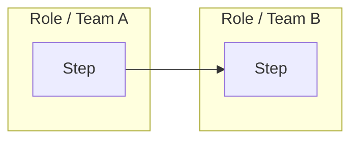

# Process Artifact Output Model

## Purpose

This file defines how the Strateq DX CDO Coworker creates exportable process artefacts from Hopper clarification fields, meeting notes, and department review feedback.

## Governance Change

Blueworks is not required as the formal process-map destination for this workflow.

Where licence access, usability, or stakeholder access makes Blueworks unsuitable, the controlled process record may be an exported Process Artifact Pack stored in the agreed company location.

## Current Process Artifact Flow

```text
Hopper Clarification fields populated
↓
Claude creates Draft Process Artifact Pack
↓
Digital Lead reviews with department
↓
Department confirms corrections
↓
Claude creates Agreed Process Artifact Pack
↓
Artefact exported and stored
↓
Jira item links to the stored artefact
```

## Inputs

Claude may use:

- Hopper clarification export
- Jira idea fields
- Jira description text
- department meeting notes
- screenshots
- attachments
- current process notes
- future requirement notes
- sponsor / champion feedback

Claude must not invent missing process steps, owners, decisions, systems, or controls.

## Required Artefact Pack

For each process, Claude should produce:

1. Process Summary
2. Current-State Swimlane Flow
3. Future-State Swimlane Flow
4. Role / Lane Definition Table
5. System / Data Touchpoint Table
6. Bottleneck and Control Gap Register
7. Open Questions
8. Approval / Agreement Record

## Swimlane Output Standard

Claude should provide swimlane flows in Mermaid where possible.

Use this structure:



If Mermaid is not suitable, provide a structured swimlane table.

## Exportable Artefact Requirement

The final output must be suitable for export to:

- PDF
- Word
- Markdown
- SharePoint page
- PowerPoint appendix

## Agreement Rule

A Claude-generated process artefact is draft until confirmed by the Digital Lead and the relevant department / champion.

The agreed artefact must show:

- process name
- version
- date
- prepared by
- reviewed by
- agreed by
- source Jira item(s)
- open issues, if any

## Storage Rule

The agreed artefact should be linked back to the Jira item and stored in the agreed company repository, such as SharePoint or the controlled project file store.

## Boundary Rule

The Process Artifact Pack supports Hopper clarification, Initiation Form development, DRB discussion, vendor/developer scoping, and adoption planning.

It does not approve the initiative or replace DRB authority.
